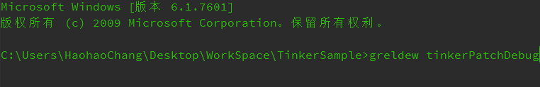
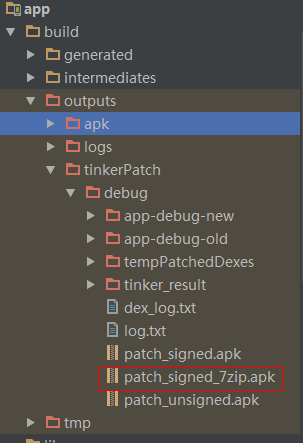

# TinkerSample
A single sample with Tinker framework.

[Tinker](https://github.com/Tencent/tinker) is a hot-fix solution library for Android, it supports dex, library and resources update without reinstalling apk.

 

## Getting started
Add tinker-gradle-plugin as a dependency in your main `build.gradle` in the root of your project:

```gradle
buildscript {
    dependencies {
        classpath ('com.tencent.tinker:tinker-patch-gradle-plugin:1.7.6')
    }
}
```

Then you need to "apply" the plugin and add dependencies by adding the following lines to your `app/build.gradle`.

```gradle
dependencies {
    //optional, help to generate the final application 
    provided('com.tencent.tinker:tinker-android-anno:1.7.6')
    //tinker's main Android lib
    compile('com.tencent.tinker:tinker-android-lib:1.7.6') 
    compile "com.android.support:multidex:1.0.1"
}
...

...
apply plugin: 'com.tencent.tinker.patch'
```

Add tinkerPatch task

```gradle
tinkerPatch {

    oldApk = "J://tinkerSample/app-debug.apk"
    ignoreWarning = true
    useSign = true
    buildConfig {
        applyMapping = null
        applyResourceMapping = null
        tinkerId = "tinkerId"
    }

    dex {
        dexMode = "jar"
        usePreGeneratedPatchDex = false
        pattern = ["classes*.dex",
                   "assets/secondary-dex-?.jar"]
        loader = ["com.tencent.tinker.loader.*",
                  "com.jc.tinkersample.SimpleApp",
                  "com.jc.tinkersample.BaseBuildInfo"
        ]
    }

    lib {
        pattern = ["lib/armeabi/*.so"]
    }

    res {
        pattern = ["res/*", "assets/*", "resources.arsc", "AndroidManifest.xml"]
        ignoreChange = ["assets/sample_meta.txt"]
        largeModSize = 100
    }

    packageConfig {
        configField("patchMessage", "tinker is sample to use")
        configField("platform", "all")
        configField("patchVersion", "1.0")
    }

    sevenZip {
        zipArtifact = "com.tencent.mm:SevenZip:1.1.10"
    }
}
```

New a class to extend `DefaultApplicationLike`

```java
@DefaultLifeCycle(
        application = "com.jc.tinkersample.SimpleApp",
        flags = ShareConstants.TINKER_ENABLE_ALL,
        loadVerifyFlag = false
)
public class SimpleAppLike extends DefaultApplicationLike {
    public SimpleAppLike(Application application, int tinkerFlags, boolean tinkerLoadVerifyFlag, long applicationStartElapsedTime, long applicationStartMillisTime, Intent tinkerResultIntent, Resources[] resources, ClassLoader[] classLoader, AssetManager[] assetManager) {
        super(application, tinkerFlags, tinkerLoadVerifyFlag, applicationStartElapsedTime, applicationStartMillisTime, tinkerResultIntent, resources, classLoader, assetManager);
    }

    @Override
    public void onBaseContextAttached(Context base) {
        super.onBaseContextAttached(base);
        MultiDex.install(base);
        TinkerInstaller.install(this);
    }

    @TargetApi(Build.VERSION_CODES.ICE_CREAM_SANDWICH)
    public void registerActivityLifecycleCallbacks(Application.ActivityLifecycleCallbacks callback) {
        getApplication().registerActivityLifecycleCallbacks(callback);
    }
}
```
Build apk and install your phone. Then copy the `app-debug.apk` to the `oldApk` path.


Fix your bug. Then run `tinkerPatchDebug` task to generate patch (new) apk.



Generated the `patch_signed_7zip.apk`



According to specified path, put `patch_signed_7zip.apk` file to your phone (external storage) root diretory. 

```java
        String path = Environment.getExternalStorageDirectory().getAbsolutePath() + "/patch_signed_7zip.apk";
        File file = new File(path);
        if (file.exists()){
            Toast.makeText(this, "patch.apk is existing.", Toast.LENGTH_SHORT).show();
            TinkerInstaller.onReceiveUpgradePatch(getApplicationContext(), path);
        }else{
            Toast.makeText(this,"patch.apk is inexistent.", Toast.LENGTH_SHORT).show();
        }
```

Do your hotfix. This is OK!   


